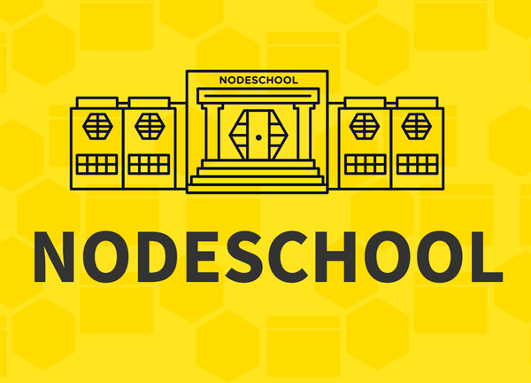

# Archivos de los cursos de [nodeschool.io]

 

## cursos:

### Fundamentos básicos y herramientas comunes

  - [ ] learnyouhtml
  - [x] javascripting
  - [ ] learnyounode
  - [ ] git-it 
  - [x] how-to-markdown
  - [ ] elementary-electron
  - [ ] how-to-npm
  - [ ] stream-adventure

___

### Electivos

  - [ ] expressworks
  - [ ] functional-javascript-workshop
  - [ ] learnyoureact
  - [ ] thinking-in-react	
  - [ ] learnyoumongo

___

Estos cursos son gratuitos y pueden encontrarse en la página oficial de [nodeschool.io]

<!-- Enlaces -->
[nodeschool.io]: https://nodeschool.io
